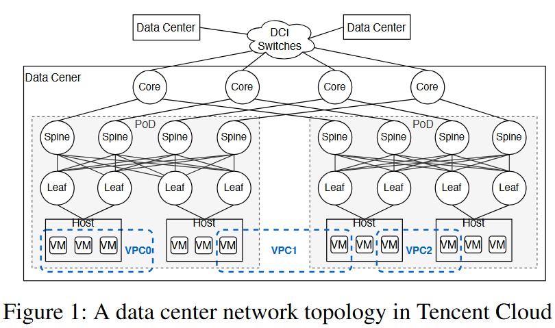
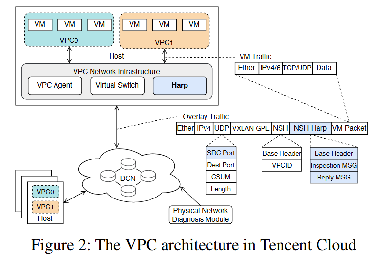
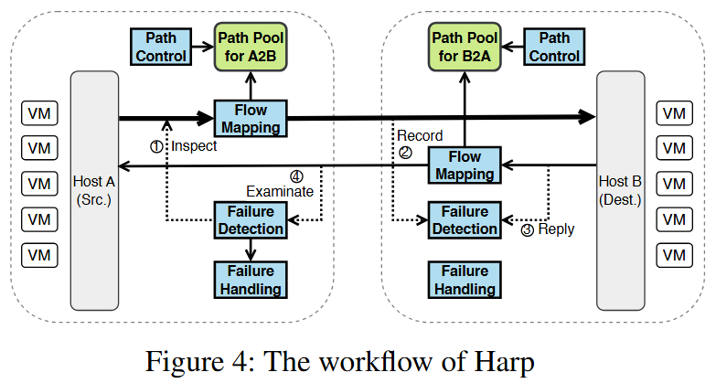

> **待确认**：VPC 网络中使用 RNIC 和 RDMA 协议吗？负载均衡使用逐包喷洒吗？乱序怎么处理（依靠 VM 内层重传）？
> **待研究**：论文3.2节的哈希计算机制【结合第5章一起分析】，UDP源端口号和路径对应关系？是否存在某些不足：（1）计算可用的UDP端口号是否难度较大（什么时候计算，提前算好还是流量传输期间不断更新）？一定能计算出可用的源端口号么（某条路径可能没有对应的端口号）？每对主机的可用源端口号是否数量相同（未必相同），如果路径数不同是否会导致负载不均？（2）存储开销会很大，每个host要存储的条目数为 host_num * host_num * Path ，这还仅是最小开销，如果无法为每条路计算出唯一的UDP端口号，则一个path要存储多个端口号、开销更大。（3）如果使用SRv6表征路径，是否不存在上述哈希计算的问题、但仍面临存储开销问题？

## 1. 论文标题
Harp: Improving VPC Network Availability via Efficient Failure Detection and Rerouting in Tencent Cloud

## 2. 会议
NSDI 2026

## 3. 作者
合作单位：腾讯（Tencent）+ 复旦大学
指导老师：Kai Zhang（张凯），复旦大学

## 4. 摘要概述
Harp 是腾讯云 VPC 网络的轻量级故障检测与恢复机制。它利用 UDP 源端口控制 ECMP 物理路径选择，为每对主机建立路径池；通过 in-band 探测实时监控路径健康状态；故障发生时亚秒级切换到健康路径。不依赖特殊硬件，对应用透明。已在腾讯云部署两年多，VPC 网络中断时间减少 78.71%-99.97%。

### 4.1 研究背景
腾讯云网络故障频发，威胁租户SLA。

### 4.2 要解决的问题
数十秒级恢复太慢，需亚秒级故障切换。

### 4.3 现有方案不足
方案依赖IPv6/改协议栈/反应慢/盲切。

### 4.4 本文解决思路
UDP源端口控ECMP路径池+带内探测+精准切换。

## 5. 背景（§2.1）

### 5.1 DCN/VPC 网络背景

腾讯 DCN 采用改良三层树形结构（Leaf → Spine → Core → DCI）。每台主机双上联两台 Leaf（NIC bonding）。Leaf+Spine+主机构成 PoD。VPC 基于 VXLAN-GPE 封装（UDP），内层 IP 可选 v4/v6，但 underlay 固定 IPv4（遗留设备限制）。每台主机运行三个模块：VPC Agent（控制面）、Virtual Switch（数据面）、Harp（故障恢复）。




### 5.2 同 VPC 跨 Host 的 VM 间通信流程

**前提**：VPC0 中 VM-A（Host-1, 10.0.0.1）→ VM-B（Host-2, 10.0.0.2）。

**第1步 — VM-A 发包**
```
Ether | SrcIP=10.0.0.1 | DstIP=10.0.0.2 | TCP/UDP | Payload
```
VM 只知道目标 IP，不知道对方在哪台物理主机。

**第2步 — Virtual Switch 查表定位 Host**
VPC Agent 维护 (VPC ID, VM IP) → Host IP 映射表，从 SDN 控制器同步：
```
VPC0 | 10.0.0.1 → 9.1.1.1 (本机)
VPC0 | 10.0.0.2 → 9.1.2.1 (目标Host-2)
```

**第3步 — VXLAN-GPE 封装**
```
┌── Outer（物理网络看）──┐  ┌── Inner（VM原始包不变）──┐
9.1.1.1 → 9.1.2.1 | UDP     Ether | 10.0.0.1 → 10.0.0.2
VXLAN-GPE | NSH(VPC0)        TCP/UDP | Payload
NSH-Harp
```
- Outer IP = 物理主机地址，DCN 只看这层
- UDP Src Port = Harp 决定，不同端口走不同 ECMP 路径
- NSH 带 VPC ID = 隔离 + 对端查表匹配

**第4步 — Harp 选路**
Flow Mapping Module 五元组哈希 → PT 槽位 → (NIC, UDP_SrcPort) → 16 条物理路径之一。

**第5步 — DCN ECMP 转发**
DCN 交换机只看 outer (9.1.1.1 → 9.1.2.1)，根据含 UDP Src Port 的五元组哈希选路：
Leaf → Spine → (Core, 跨PoD) → Spine → Leaf → Host-2

**第6步 — Host-2 解封装，送 VM-B**
剥离 outer → 读 NSH(VPC0) → 查本地映射 → 确认 10.0.0.2 是本机 VM-B → 剥离 VXLAN-GPE/NSH → 送原始包给 VM-B。

**一句话流程**：
VM 发包 → Virtual Switch 查表 → VXLAN-GPE 封装(NSH带VPC ID) → Harp 选 UDP Src Port → DCN ECMP 转发 → 对端解封装(NSH匹配VPC) → 送目标 VM。

### 5.3 VXLAN 端口与可靠性

**Q1: VXLAN UDP 端口如何配置？**
Dst Port = 4789（IANA 标准），固定。Src Port 通常由 hash(inner 五元组) 生成以提供 ECMP 熵；Harp 则主动操控 Src Port，按 rPath 集合精确映射到目标物理路径。

**Q2: 封装成 UDP 后是否失去可靠性与拥塞控制？**
外层 UDP 仅做轻量隧道，无拥塞控制。内层 TCP 保留完整可靠性（重传、乱序重组、拥塞控制）——外层丢包由内层 TCP 照常感知并反应，两者独立。

### 5.4 网络故障与动机（§2.2-2.3）

故障分布：DCI 31%、Core 29%、Spine 23%、Leaf 11%（94% 交换机硬件）、配置错误 6%。故障原因包括光模块损坏、接口 down、重启、link flapping、静默丢包、ACL/路由误配等。
租户 SLA 持续收紧（Redis <200ms、CFS 亚毫秒、COS 99.995%），要求亚秒级恢复。物理诊断方法（ping+交换机上报）耗时数十秒至数分钟，太慢。多路径方案（MPTCP/PRR/SRD）不适配：遗留设备无 IPv6、需改 VM 协议栈、切换后可能仍走故障路径。

## 6. Harp 设计概述（§3.1）

核心思路：为每对主机构建确定性物理路径池，实时监控健康状态，故障时亚秒级切至健康路径。利用 UDP 源端口操控交换机 ECMP 转发。
四大模块：路径控制（建路径池）、流映射（哈希选路+NIC+UDP端口封装）、故障检测（源端插探测报文、目的端记录并周期回复）、故障处理（更新映射切至健康路径）。
三大优势：监控全路径状态精准切换、不依赖特殊硬件、对应用透明支持任意协议。覆盖范围：丢包类故障（设备/链路/NIC），不覆盖帧校验等数据损坏。



### 6.1 确定性路径控制（§3.2）

每对主机 16 条物理路径（2 sLeaf × 4 Spine × 2 dLeaf）。UDP 源端口是 underlay 五元组中唯一可变字段。逐跳按 ECMP 哈希将端口分成 Ni 组，多跳取交集得 rPath——同一 rPath 内端口始终走同一物理路径，不同 rPath 必走不同路径。同层交换机 ECMP 配置相同，rPath 计算一次全 DC 复用。8 个 rPath + eth0/eth1 轮询 = 覆盖 16 条路径。局限：ECMP 线性性仅适用 DC 内（跨 DC 无效）；少数交换机交集为空 → 路径池扩展为 64 端口倍数补偿。

### 6.2 路径控制的不足

计算难度：算法简单（枚举+哈希+分组+交集），一次计算全 DC 复用，不在转发路径上。端口可用性：多跳交集可能为空（哈希分布不均），论文以 64 端口扩展补偿，但未保证每条物理路径必有端口映射。负载均衡：同 Pod 内同配置可复用（端口数一致），跨 Pod 异构设备可能端口数不同，导致路径间负载不均。论文坦承并标记为未来工作（引入随机偏移改善）。

## 7. 部署经验（§5）

**端主机问题（§5.1）**：（1）NIC 缓冲区溢出丢探测包 → 嵌入 NIC 丢包计数，连续丢弃才判故障；（2）CPU 过载导致排队延迟 → 不检查检查周期末尾几毫秒的活跃路径；（3）Harp 路径健康位图模式（0x0101...01 / 0x1010...10）可辅助定位故障 Leaf/NIC。

**规模化挑战（§5.2）**：动态路由 → 固定 ECMP 配置 + 离线工具月度更新 rPath；探测周期 → M×C < 200ms（首次 TCP RTO），生产系统周期数毫秒级；低利用率路径 → 临时重定向探测包覆盖未使用路径，限制数量防乱序。

**计划优化（§5.3）**：SmartNIC 硬件时间戳消除排队延迟误判 + 精确测量逐路径延迟优化负载均衡；网关场景多 ECMP 组 + DSCP 切换实现路径控制。


